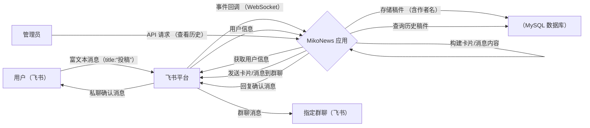
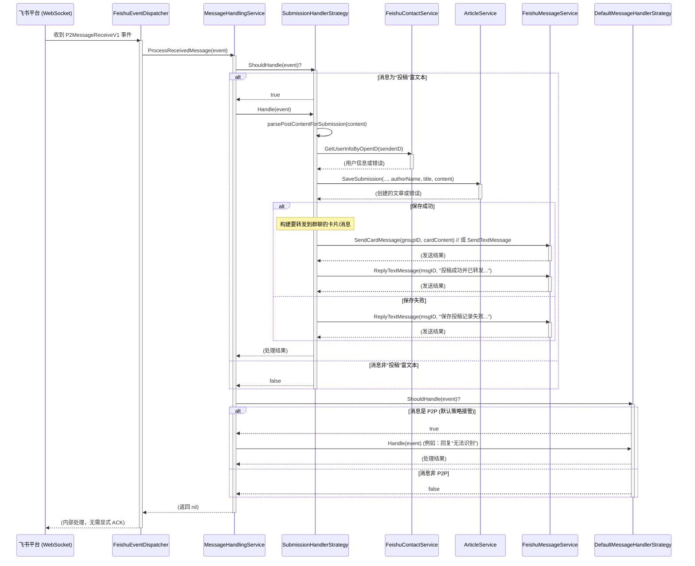

# Miko News 飞书机器人

Miko News 是一个飞书机器人应用，旨在简化社区新闻的收集和分享流程。用户可以通过与 Miko 机器人私聊轻松投稿，机器人会自动将内容转发到指定的飞书群聊，并同时将稿件存档到数据库中作为备份记录。

---

## 面向用户 (For Users)

### 功能简介

*   **用户**: 通过飞书私聊 Miko 机器人，使用特定格式发送内容即可完成投稿。机器人会确认收到并告知您内容已被转发。
*   **群成员**: 在预先配置好的飞书群聊中接收由机器人转发的最新投稿内容。
*   **管理员/运营**: 机器人自动完成转发和存档。您可以使用配套的 API (如果需要) 来查看历史投稿记录。

### 如何部署 (推荐)

这是推荐给最终用户的部署方式，使用 Docker 镜像运行。

**前提条件:**

*   一台可以访问互联网并安装了 [Docker](https://docs.docker.com/get-docker/) 的服务器。
*   一个可用的、**外部的** MySQL 数据库 (版本 5.7 或更高)。Miko News 容器本身**不包含**数据库。
*   拥有一个配置好的飞书应用 (获取 App ID, App Secret 等信息)。
*   获取 Miko News 的 Docker 镜像 (例如：`docker pull krisxia/miko-news:latest`)。

**部署步骤:**

1.  **初始化数据库:**
    *   连接到您的**外部** MySQL 数据库。
    *   执行项目 `migrations/init.sql` 文件中的 SQL 脚本，创建所需的表结构。
      ```bash
      # 示例命令 (请替换为您的实际数据库信息)
      mysql -h your-external-mysql-host -u your-db-user -p your-db-password your-db-name < migrations/init.sql
      ```

2.  **准备环境变量:**
    *   创建一个环境变量文件 (例如 `miko.env`)，或者准备好在 `docker run` 命令中直接传入环境变量。内容应基于项目根目录下的 `.env.example` 文件，至少需要包含数据库连接信息、飞书 App 配置、以及要推送的群聊 ID (`FEISHU_GROUP_CHATS`)。
    *   示例 `miko.env` 内容:
      ```dotenv
      # .env example for docker run
      APP_ENV=production
      
      # Database Config (Required)
      DB_HOST=your-external-mysql-host
      DB_PORT=3306
      DB_USER=your-db-user
      DB_PASSWORD=your-db-password
      DB_NAME=your-db-name
      DB_MAX_OPEN_CONNS=10
      DB_MAX_IDLE_CONNS=5
      
      # Feishu Config (Required)
      FEISHU_APP_ID=your_app_id
      FEISHU_APP_SECRET=your_app_secret
      FEISHU_VERIFICATION_TOKEN=
      FEISHU_ENCRYPT_KEY=
      # Group Chats (Required, comma-separated)
      FEISHU_GROUP_CHATS=oc_your_group_id1,oc_your_group_id2 # 使用逗号分隔多个ID
      
      # Server Config (Required)
      SERVER_PORT=8080
      
      # Logger Config (Optional, defaults are usually fine)
      LOG_LEVEL=info
      LOG_PATH=/app/logs/miko-news.log 
      ```

3.  **启动服务:**
    *   使用 `docker run` 命令启动容器，并通过 `--env-file` 或多个 `-e` 参数传入环境变量。
      ```bash
      # 使用 --env-file (推荐)
      docker run -d --name miko-news \
        --network host \ # 或者使用 bridge 网络并暴露端口 -p 8080:8080
        --env-file ./miko.env \
        -v ./logs:/app/logs \ # 挂载日志目录 (可选)
        krisxia/miko-news:latest # 替换为实际镜像名
      
      # 或者使用 -e 参数 (示例)
      # docker run -d --name miko-news \
      #   --network host \
      #   -e DB_HOST=... \
      #   -e DB_USER=... \
      #   -e DB_PASSWORD=... \
      #   -e DB_NAME=... \
      #   -e FEISHU_APP_ID=... \
      #   -e FEISHU_APP_SECRET=... \
      #   -e FEISHU_GROUP_CHATS=oc_id1,oc_id2 \
      #   krisxia/miko-news:latest
      ```
    *   服务将在后台启动。

**重要提示:**

*   请务必将示例中的 `krisxia/miko-news:latest` 替换为您实际使用的 Docker 镜像名称和标签。
*   确保容器可以访问到您配置的外部 MySQL 数据库。
*   环境变量的名称必须与 `.env.example` 文件中定义的**大写**变量名一致 (例如 `DB_HOST`, `FEISHU_APP_ID` 等)，以便应用程序能够正确读取。

### 如何投稿

1.  在飞书中找到 Miko News 机器人并发起私聊。
2.  发送 **富文本 (Post)** 消息，格式如下：
    *   消息的 **标题 (Title)** 必须设置为 **`投稿`** (这两个字，没有其他字符)。
    *   富文本内容的第一行应 **加粗 (Bold)**，这将作为新闻的标题。
    *   富文本的其余内容将作为新闻正文。
    *   示例消息结构 (内部 JSON 格式，飞书客户端会为您生成):
        ```json
        {
          "title": "投稿",
          "content": [
            [{"tag":"text","text":"这是加粗的标题","style":["bold"]}],
            [{"tag":"text","text":"这是第一行正文。"}],
            [{"tag":"text","text":"这是第二行正文。"}]
          ]
        }
        ```
3.  发送成功后，机器人会回复确认消息，告知您稿件已收到并已被转发。

### 管理员操作 (通过 API)

(当前版本主要流程为自动转发，API 操作可能有限)

如果需要查看历史投稿记录，可以通过 Miko News 提供的 HTTP API 进行：

*   **查看稿件**: 获取已存档的稿件列表或特定稿件。

具体的 API 端点和使用方法，请参考开发者部分的 API 文档或直接查看代码。

---

## 面向开发者 (For Developers)

### 技术栈

*   **语言**: Go 1.24+
*   **Web 框架**: Gin
*   **数据库**: MySQL 5.7+
*   **ORM**: GORM
*   **飞书 SDK**: [larksuite/oapi-sdk-go/v3](https://github.com/larksuite/oapi-sdk-go)
*   **日志**: Zap + Lumberjack
*   **部署**: Docker & Docker Compose

### 系统概览

#### 1. 系统流程



#### 2. 消息处理流程 (策略模式)

机器人通过 WebSocket 接收私聊消息，并通过策略模式处理：



### 项目设计

#### 1. 设计理念

*   **分层架构**: 清晰分离 API、业务逻辑 (Service)、数据访问 (Repository)。
*   **依赖注入**: 主要在 `cmd/main.go` 和 `internal/bot/feishu_bot.go` 中组装依赖。
*   **面向接口**: Service 和 Repository 层都定义了接口。
*   **策略模式**: 用于处理不同类型的飞书消息。
*   **标准化**: 统一的日志、配置管理、错误处理和 API 响应结构。

#### 2. 项目结构

```
MikoNews/
├── cmd/                    # 应用程序入口 (main.go)
├── configs/                # 配置文件目录 (.yaml, .example)
├── docs/                   # 项目文档 (deployment.md)
├── internal/
│   ├── api/                # API 相关 (Gin)
│   │   ├── handler/        # HTTP 处理器
│   │   ├── middleware/     # HTTP 中间件
│   │   ├── router/         # 路由配置 (待完善)
│   │   └── server.go       # API 服务器启动与配置
│   ├── bot/                # Feishu Bot (WebSocket 实现)
│   │   ├── feishu_bot.go
│   │   └── feishu_event_dispatcher.go (可能存在)
│   ├── config/             # 配置加载逻辑
│   ├── database/           # 数据库连接 (GORM)
│   ├── model/              # 数据模型 (GORM 结构体)
│   ├── pkg/                # 内部公共库
│   │   ├── errors/         # 自定义错误
│   │   ├── logger/         # Zap 日志配置与全局函数
│   │   └── response/       # API 标准响应
│   ├── repository/         # 数据仓库层 (接口 + MySQL 实现)
│   │   ├── article_repository.go
│   │   └── impl/mysql/
│   └── service/            # 业务逻辑层 (接口 + 实现)
│       ├── article_service.go
│       ├── feishu_contact_service.go
│       ├── feishu_message_service.go
│       ├── message_handling_service.go (策略模式接口)
│       └── impl/           # 服务实现
│           ├── article_service.go
│           ├── feishu_contact_service.go
│           ├── feishu_message_service.go
│           └── messagehandler/ # 消息处理策略实现
│               ├── default_message_handler.go
│               ├── message_handling_service.go
│               └── submission_handler.go
├── migrations/             # 数据库迁移脚本 (init.sql)
├── scripts/                # 辅助脚本 (暂无)
├── test/                   # 测试文件 (待完善)
├── .env.example            # Docker 环境变量模板
├── .gitignore
├── .dockerignore
├── Dockerfile
├── docker-compose.yml
├── go.mod
└── go.sum
```

### 本地开发 (使用 Docker Compose)

对于本地开发和测试，推荐使用 Docker Compose 来快速启动服务及其依赖（如果配置了的话）。

**前提条件:**

*   Go 1.24+ (用于代码编辑、编译、测试等本地操作)
*   [Docker](https://docs.docker.com/get-docker/)
*   [Docker Compose](https://docs.docker.com/compose/install/)
*   MySQL 5.7+ (如果是外部数据库；`docker-compose.yml` **可能** 包含一个用于开发的数据库服务)
*   飞书开发者账号和应用配置

**步骤:**

1.  **配置:**
    *   复制环境变量模板文件: `cp .env.example .env`
    *   编辑 `.env` 文件，填入您的飞书应用配置 (App ID, Secret等) 和 MySQL 数据库连接信息。**注意：这里的数据库配置应指向您本地开发使用的数据库** (可能是 Docker Compose 启动的，也可能是本地安装的)。
    *   **检查 `docker-compose.yml`**: 确认它是否定义了数据库服务，或者它期望连接到哪个数据库地址。
    *   (可选) 如果需要修改非环境变量控制的配置，可以编辑 `configs/config.yaml` (基于 `configs/config.yaml.example` 创建)。

2.  **数据库初始化:**
    *   连接到您本地开发使用的 MySQL 数据库。
    *   执行 `migrations/init.sql` 脚本创建表结构。
      ```bash
      # 示例: 连接到本地 docker-compose 启动的 mysql 服务
      # mysql -h 127.0.0.1 -P 3306 -u user -p password miko_news < migrations/init.sql
      ```

3.  **启动服务:**
    *   在项目根目录运行:
      ```bash
      docker-compose up --build -d # --build 确保使用最新代码构建镜像
      ```
    *   服务（以及可能的数据库服务）将在后台启动。您可以使用 `docker-compose logs -f` 查看日志。

### API 接口

(当前版本下，API 主要用于查看历史记录)

*   `GET /health` - 健康检查
*   `GET /ping` - 服务可用性检查
*   (预期可能存在的接口)
    *   `GET /api/v1/articles` - 获取已存档的文章列表 (可添加过滤参数: 如按作者、时间范围)
    *   `GET /api/v1/articles/:id` - 获取特定存档文章详情

### 扩展开发

为项目添加新功能（例如，增加评论功能）的大致步骤：

1.  **模型**: 在 `internal/model/` 中定义新的数据模型 (`comment.go`)。
2.  **迁移**: 在 `migrations/` 中添加新的 SQL 脚本以创建 `comments` 表。
3.  **仓库**: 在 `internal/repository/` 定义 `CommentRepository` 接口并在 `impl/mysql/` 中实现。
4.  **服务**: 在 `internal/service/` 定义 `CommentService` 接口并在 `impl/` 中实现业务逻辑 (可能需要依赖 `CommentRepository` 和 `ArticleRepository`)。
5.  **处理器**: 在 `internal/api/handler/` 创建 `comment_handler.go` 处理 HTTP 请求。
6.  **路由**: 在 `internal/api/router/router.go` 中添加新的路由，指向 `CommentHandler` 的方法。
7.  **主程序**: 在 `cmd/main.go` 中初始化新的 Repository, Service, Handler 并注入依赖。

### 测试

(测试覆盖率可能不完整)

```bash
# 运行所有测试
go test ./...

# 查看测试覆盖率
go test -cover ./...
```

### 部署 (Docker 镜像)

如需将应用部署到生产或测试环境，请参考 **面向用户** 部分关于使用 `docker pull` 和 `docker run` 的部署说明。

### 许可证

本项目采用 MIT 许可证 - 详见 `LICENSE` 文件。
